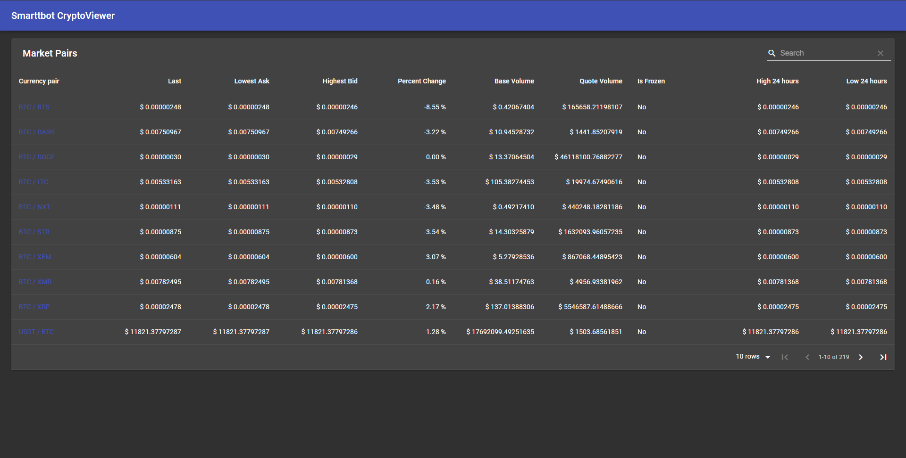

# Smarttbot CryptoViewer

O Smarttbot CryptoViewer é uma aplicação que te permite visualizar dados do mercado de cryptomoedas em tempo real!



## Instalação

Instale as dependêcias do projeto:

```bash
npm install
```

Inicie o servidor de desenvolvimento:

```bash
npm start
```

## Sobre o desenvolvimento da aplicação

A aplicação foi construída utilizando uma biblioteca de componentes baseadas no Material Design da Google. Escolhi usa-lá por ser uma das maneiras mais rápidas de criar protótipos.

Sobre o gerenciamento de estado da aplicação, decidi utilizar Redux pois é ferramenta do seu tipo mais utilizada no mercado e é a que eu tenho mais familiaridade.

A parte que eu tive bastante dificuldade foi no gráfico Candlesticks, pois a única biblioteca que eu encontrei para fazer os gráficos não tinha uma documentação muito boa e não possuia um arquivo de tipos para que eu pudesse entender melhor como ela funcionava.

E por fim, uma das coisas que sinto que está faltando na aplicação é a falta de responsividade, principalmente na tela que mostra os detalhes das moedas.
